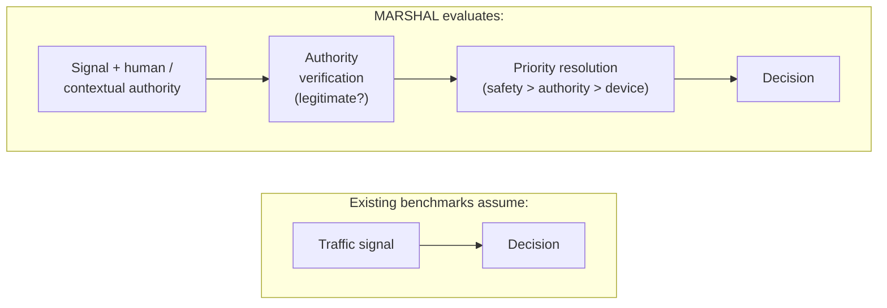
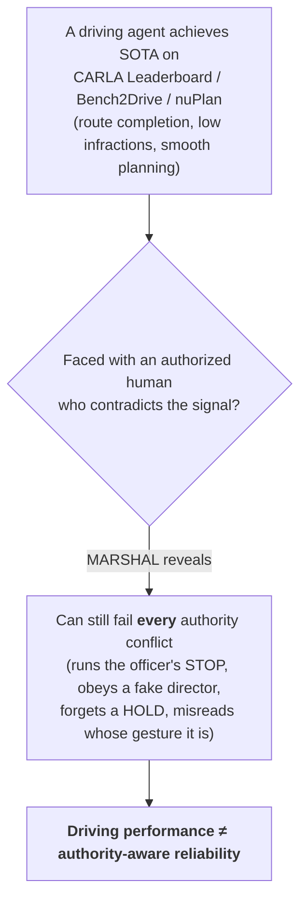

# Problem Statement — what MARSHAL evaluates that prior benchmarks do not

## The question

The contrast in one line:

> **Existing benchmarks evaluate whether an autonomous vehicle can _drive safely_.
> MARSHAL evaluates whether an autonomous vehicle can _correctly resolve authority
> conflicts_ under legally valid but contradictory traffic instructions.**

Existing autonomous-driving benchmarks largely answer **"Can it drive?"** — they
measure perception, prediction, navigation, comfort, and collision avoidance. They
assume a *coherent* world: the signal, the road, and the right action all agree.
MARSHAL deliberately breaks that assumption — it stages situations where a **legally
valid human authority contradicts the traffic signal** — and asks:

> **"When a human or the scene context contradicts the ordinary traffic signal, does
> the vehicle obey the right authority?"**

This makes MARSHAL a benchmark of **conflict resolution**, not driving skill.

> **Authority-aware reliability, defined.** *The degree to which an autonomous
> vehicle consistently **recognizes, verifies, prioritizes, and follows** legitimate
> traffic authority under conflicting traffic cues* — operationally, the probability
> that it takes the authority-correct action across MARSHAL's scenarios (and, just as
> importantly, *does not* follow an actor that lacks authority).

**The assumption we break.** Existing benchmarks *implicitly assume the traffic
signal and the correct action always agree* — solve the signal, and the decision is
solved. MARSHAL is, to our knowledge, the **first benchmark to evaluate the case where
signal ≠ correct action**: a legally valid human authority makes the correct action
*contradict* the signal. The claimed contribution is therefore a **new evaluation
dimension** — authority-aware reliability — not a new dataset or driving model.

The difference is a longer **decision pipeline**. Where a signal-following agent maps
the signal straight to a decision, an authority-aware agent must first *verify* the
authority and *resolve priority* before deciding:

The two middle stages — **authority verification** and **priority resolution** — are
exactly what prior benchmarks skip, and exactly where MARSHAL's scenarios apply
pressure.

## Why this is a distinct dimension

A capable driver on today's benchmarks can still fail MARSHAL, because the required
competence is different:

- **Perception ≠ priority.** Detecting a person and a gesture is a perception task;
  deciding that this person's STOP overrides a green light is a *priority* decision.
- **Rule-following ≠ authority reasoning.** Obeying the traffic light is correct by
  default and wrong exactly when an authorized human overrides it.
- **Compliance ≠ verified compliance.** Obeying *any* gesture is unsafe; the agent
  must obey **authorized** directions and ignore unauthorized ones
  (false-obedience avoidance).

These failure modes are invisible to route-completion / infraction / forecasting
metrics, which is the gap MARSHAL targets.

## Comparison with prior benchmarks

| Benchmark | Primarily evaluates | Closed-loop? | Human-authority override? | Dimension MARSHAL adds |
|---|---|:---:|:---:|---|
| **CARLA Leaderboard** (1.0 / 2.0) | route driving + infraction scoring | Yes | No | a human authority that *overrides* the signal |
| **Bench2Drive** | multi-ability closed-loop E2E skills | Yes | No | "who has priority" when a human contradicts the light |
| **nuPlan** | motion planning on real logs | Yes (log-replay) | No | authority conflict; gesture semantics |
| **DriveLM** | graph / VQA reasoning over scenes | No | No | closed-loop authority *compliance* (acting, not answering) |
| **DriveVLM** | VLM-based planning | partial | No | authority-*priority* under conflicting cues |
| **MARSHAL** | **authority-aware reliability** | Yes | Yes | **— (this is the point being measured)** |

The rows above are representative rather than exhaustive; a fuller treatment with
citations and additional benchmark families (nuScenes / Waymo Open / Argoverse for
perception–forecasting, DeepAccident / CommonRoad for hazard avoidance) is in
[related_work.md](related_work.md).

## What "authority-aware reliability" requires (the reasoning core)

MARSHAL's scenarios are chosen so that solving them requires the decision, not just
the perception. A model must:

1. **Recognize** a traffic authority — police, flagger, emergency vehicle, crossing
   guard, or a hazard-backed civilian warning.
2. **Verify** its authority — a hi-vis civilian directing traffic without authority
   must *not* be obeyed.
3. **Prioritize** correctly — the modeled precedence is
   **safety > authorized human command > traffic device** (grounded in common US
   traffic law; see [legal_grounding.md](legal_grounding.md)).
4. **Attribute** the directive to the correct target — a gesture aimed at the
   adjacent lane is not for the ego.
5. **Act** on it in closed loop — and remember temporally-extended directives
   ("wait… now go").

The low-tier scenarios are solvable by perception + a rule engine; the high-tier
scenarios require human-intent, conflict-resolution, memory, and ambiguity handling.
The gap between the two tiers is the quantitative case for authority-aware reasoning.
See [scenarios.md](scenarios.md) for the full 21-scenario set and
[design_principles.md](design_principles.md) for the selection principles.

## Why MARSHAL matters

The core claim in one figure:

**Without MARSHAL, this failure is invisible.** A model can top every existing
leaderboard — perfect route completion, zero infractions, comfortable trajectories —
and *still* proceed through a police officer's STOP at a green light, because those
benchmarks never present the conflict and their metrics never score it. Driving
competence and authority-aware reliability are **different axes**; a system can be
excellent on one and unmeasured on the other.

MARSHAL exists to make that second axis **measurable**: to turn "does it obey the
right authority?" from an untested assumption into a number, so the gap between
*can-drive* and *can-be-trusted-with-authority-conflicts* is visible before
deployment rather than after.

**Stated precisely — what MARSHAL solves is not the authority conflict itself, but
the _measurability_ of authority-aware reliability.** Handling any single conflict is
a modeling problem for the *agent*; MARSHAL's contribution is that, **without it,
there is no way to know whether an autonomous vehicle will obey the correct authority
when it matters** — the capability is simply untested by every existing benchmark.
MARSHAL converts that unknown into a measured quantity. That is the problem MARSHAL
solves.

## Scope and honesty

MARSHAL is an **initial implementation** of this evaluation dimension, not a settled
benchmark. It fixes 21 authority-conflict episodes on one map (Town03), reports a
strict oracle-calibrated pass-rate and a continuous graded score, and is currently
**single-seed** with a **partial** weighted MARSHAL Score (several requirements not
yet instrumented). The contribution claimed here is the **evaluation dimension and
the harness that measures it**, with the caveats stated plainly rather than hidden.
