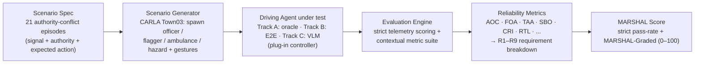

# What is MARSHAL?

## One-sentence definition

> **MARSHAL is a benchmark that provides a closed-loop evaluation framework for
> measuring the _authority-aware reliability_ of a driving agent — how correctly it
> recognizes, prioritizes, and acts on human or contextual traffic authority when
> that authority conflicts with the ordinary traffic signal.**

Both halves of that sentence are load-bearing, and paper readers distinguish them:

- **As a *benchmark*,** MARSHAL fixes a standard, versioned set of **21
  authority-conflict scenarios** and a privileged **oracle** that defines the
  correct action for each — so results are comparable across agents and over time.
- **As an *evaluation framework*,** MARSHAL provides the **harness** that runs any
  plugged-in agent through those scenarios and scores it from telemetry (the strict
  verdict + the contextual metric suite + `MARSHAL-Graded`).

> **The quantity it measures — *authority-aware reliability*** — is *the degree to
> which an agent consistently **recognizes, verifies, prioritizes, and follows**
> legitimate traffic authority under conflicting traffic cues* (operationally, the
> probability of the authority-correct action across MARSHAL's scenarios). See
> [problem_statement.md](problem_statement.md) for the full framing and why prior
> benchmarks leave it unmeasured.

## What MARSHAL is *not*

MARSHAL is **not a driving model, not a planner, and not an LLM.** It is the
benchmark + scoring harness *around* those systems:

- You **plug in** any driving agent as a *controller* (a privileged oracle, an
  end-to-end model, or a VLM decision policy).
- MARSHAL **generates the scene** (spawns the officer, the flagger, the ambulance,
  the hazard, and their gestures), **runs the episode** in CARLA, and **returns
  reliability metrics**.

MARSHAL does not decide how to drive; it decides *how well an agent obeyed the right
authority* — and reports that as a score.

## The pipeline (one figure)



**Reading the pipeline:** the left half is *fixed by MARSHAL* (the same scenes and
correct answers for every agent); the middle is *your agent*; the right half is
*what MARSHAL computes*. Only the agent changes between runs — the scenes, the
scoring, and the oracle reference stay constant, which is what makes the numbers
comparable across agents.

## How a run works (6 steps)

1. **Scenario spec** — one of 21 episodes fixes the traffic signal, the authority
   figure (or hazard), and the privileged *correct action* (the "E-tuple").
2. **Scene generation** — MARSHAL spawns the ego at a curated Town03 location and
   places the officer / flagger / ambulance / hazard, then triggers the gesture at a
   defined onset time.
3. **Agent control** — the agent under test receives its observation each tick
   (ground truth for the oracle; native sensors for Track-B; a front camera for
   Track-C) and emits vehicle control.
4. **Telemetry capture** — MARSHAL records the full ego trajectory (speed, position,
   junction entry, lateral offset, collisions) plus the gesture timing.
5. **Scoring** — the telemetry is scored two ways: a **strict, binary** pass/fail
   that only passes when the trajectory physically proves the expected action, and a
   **contextual metric suite** (see [metrics](metrics.md)).
6. **Scoreboard** — per-episode results aggregate into the strict pass-rate and the
   continuous **MARSHAL-Graded** score (see [marshal_graded_score.md](marshal_graded_score.md)).

## Plug in your model

```bash
# reference bounds
python start.py --controller baseline    # officer-blind lower bound
python start.py --controller oracle      # privileged upper bound

# your own agent (one EpisodeController subclass)
python start.py --controller my_pkg:MyController --tag my_model
```

See [benchmarking_your_model.md](benchmarking_your_model.md) for the controller
contract.

## The three evaluation tracks

The **same scenario** is presented under three input/observation regimes so that
closed-loop driving and visual decision-making are scored on comparable scenes but
reported separately (full definitions in [tracks.md](tracks.md)):

- **Track A — Privileged oracle.** Reads ground truth; the upper bound the scorer is
  calibrated against. Not a deployable model.
- **Track B — Closed-loop driving agent.** Emits `VehicleControl` every tick on its
  native sensor rig; scored from telemetry.
- **Track C — Visual Decision QA.** Answers the ego action from front-camera frames;
  a measure of whether a VLM reads authority from images, not a closed-loop driving
  score.

## Current status (honest scope)

MARSHAL is an **early but working implementation**, not a finished, fully-validated
benchmark. What exists today: the 21-scenario closed-loop harness on stock Town03,
the officer/gesture engine, oracle-calibrated strict scoring, the continuous
MARSHAL-Graded score, and a reference sweep across 14 controllers. **Known
limitations we keep visible:** results are currently **single-seed**; the weighted
**MARSHAL Score is partial** (several requirements, **R4–R6 and R8–R9**, are declared
but **not yet instrumented**); and the strongest agents share a **conservative
stop-bias** that the graded score is designed to account for. These are documented
rather than hidden, and are the work items for subsequent cycles.

---

*See also:* [problem_statement.md](problem_statement.md) (what problem MARSHAL
solves and how it differs from prior benchmarks), [scenarios.md](scenarios.md) (all
21 scenarios), [design_principles.md](design_principles.md) (authority types and
scenario-selection principles).
